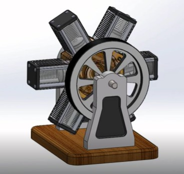

# Six Piston Radial Engine - CAD Models

## Overview
This repository contains the 3D CAD files for a Six-Piston RS brake caliper system. These models are designed for mechanical reference, structural analysis, rendering, or integration into larger vehicle assemblies.

## Demonstration & Visuals
Check out the demonstration and overview video for a closer look at the design. Click the image below to watch the video:

*(Note: To make the image above work, take a screenshot of your video, save it as `thumbnail.jpg`, and upload it to the main folder of this repository.)*

## Repository Contents
*(Note: Update this section based on the specific formats you uploaded)*
* `/Native_Files/` - Native CAD files (e.g., SolidWorks, Fusion 360, or CATIA) containing the full assembly and individual part features.
* `/STEP/` - Universal `.STEP` files for easy import into any 3D modeling or FEA software.
* `/STL/` - Mesh files suitable for 3D printing or quick viewing.

## Usage
To explore or modify the models:
1. Clone or download this repository.
2. Open the main assembly file in your preferred CAD software. 
3. If your software does not support the native file type, import the provided `.STEP` file.

## Applications
These models can be utilized for:
* Computational Fluid Dynamics (CFD) for cooling analysis
* Finite Element Analysis (FEA) for stress and deformation testing
* Clearance checking in custom wheel/suspension designs
* High-fidelity 3D rendering

## License
[Insert License Type Here, e.g., MIT, CC-BY-4.0, or state if it is for personal/educational use only]
